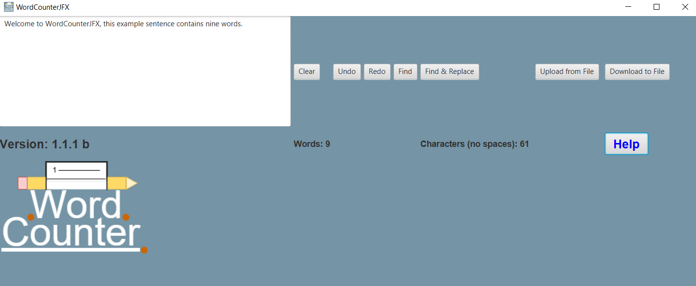

# WordCounterJFX - Another word counter app built in Java!

 ## Table of Contents
 
 - [Introduction](#introduction)
 - [Features](#features)
 - [Changing the Code](#changing-the-code)
 - [Steps to Run the Code](#steps-to-run-the-code)
 - [Usage](#usage)
 - [Technologies Used](#technologies-used)
 - [Project Structure](#project-structure)

## Introduction

- The Word Counter App is a JavaFX-based GUI application that allows users to analyze text by counting words and characters.
 
- The app includes additional functionalities such as finding and replacing text, undoing and redoing changes, and uploading/downloading text files for analysis.
	
## Features
	
- **Word and Character Counting:** Calculates the total number of words and characters in the input text.
	
- **Find and Replace:** Allows users to search for specific words or phrases and replace them with new ones.
	
- **Undo/Redo:** Provides the ability to undo and redo text changes for flexibility in text editing.
	
- **Upload/Download from File:** Supports loading text from a file and saving analyzed results back to a file.
	
- **Clear Text:** Easily clear the current text input to start new.
	
## Changing the Code
	
- **Java 22:** This app is built using Java 22
- **JavaFX SDK:** This application uses the JavaFX SDK for the GUI components. The JavaFX SDK is included in the repo, however, if issues arise the download for the JavaFX SDK can be found here - https://openjfx.io/.
	
## Steps to Run the Code
        
- 1. Clone the Repository: "git clone https://github.com/jbranch96/Word-Counter-App-JFX.git"
- 2. Compile and Run:
	- Navigate to the project folder and run the batch files:
		- To compile:  **./compile.bat**
		- To run:      **./run.bat**
	
## Usage
	
- Launch the Application: Upon starting the app, you will be presented with a user-friendly text area for input.
	        
- Enter Text: Type or paste text into the text field.
	        
- Count Words/Characters: The word and character counts are automatically displayed in real-time as you type.
	        
- Use Additional Features:
	- Find and replace text using the provided options.
 	- Clear the text, or undo/redo your previous actions.
  	- Upload a text file for analysis or download the current text as a file.

## Tech Used
	
- Java 22: Core language used for building the application.
- JavaFX 23: For designing the graphical user interface (GUI).
	
## Project Structure

        │
        ├── bin/                            # Compiled .class files
        ├── libs/                           # JavaFX SDK and other dependencies
        ├── src/                            # Source files
        │   └── WordCounterJFX/             
        │       ├── mainapp/                # Main entry point
        │       ├── controller/             # Controllers for the app's logic
        │       ├── model/                  # Model classes for undo/redo and word counting
        │       ├── utils/                  # Utility classes for managing file I/O, icons, etc.
        │       └── view/                   # UI classes (JavaFX GUI components)
        ├── compile.bat                     # Batch file to compile the app
        └── run.bat                         # Batch file to run the app
